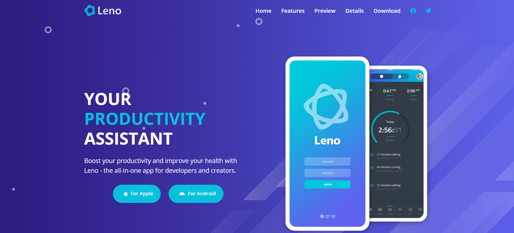
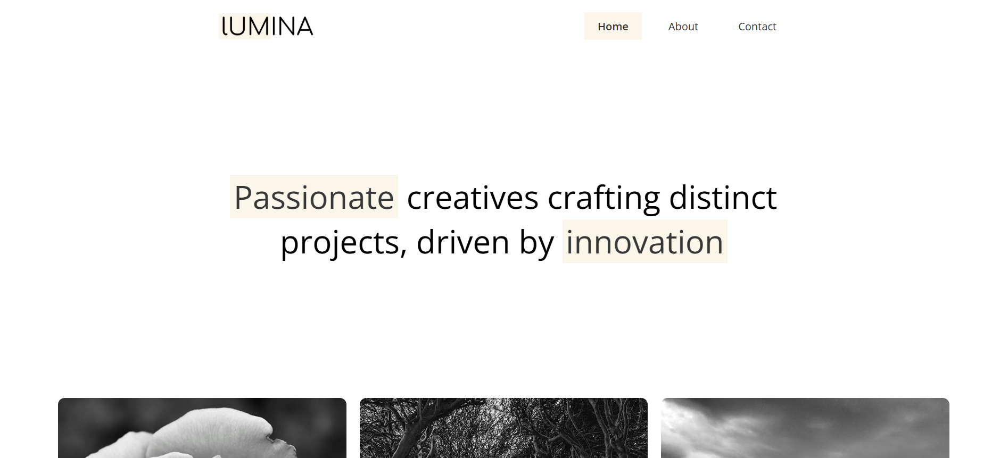
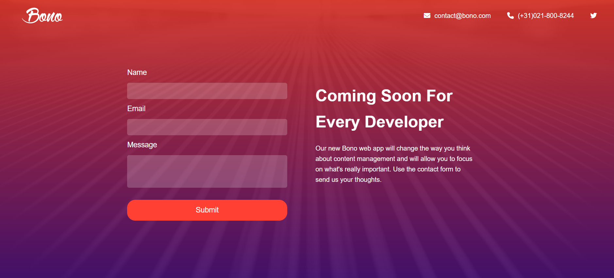

# Modern-HTML-CSS-From-The-Beginning

Welcome to the project showcase for the **Modern HTML & CSS From The Beginning** course. This repository features multiple responsive websites created using HTML5, CSS3 (with BEM methodology where applicable), and JavaScript to demonstrate core web development concepts.

---

## 📁 Table of Contents

- [Leno – Productivity App Landing Page](#leno--productivity-app-landing-page-🚀)
- [Tutor – Online Course Landing Page](#tutor--online-course-landing-page-🌟)
- [Lumina Creative – Agency Website](#lumina-creative--agency-website-💻)
- [Bono – Landing Page Form](#bono--landing-page-form-💎)

---

## Leno – Productivity App Landing Page (BEM) 🚀

A clean and modern landing page for showcasing a mobile productivity app.

🔗 **Live URL:** [https://udemy-html-leno-website.vercel.app/index.html](https://udemy-html-leno-website.vercel.app/index.html)  
📂 **GitHub Repo:** [View on GitHub](https://github.com/SadiaShakiba/Modern-HTML-CSS-From-The-Beginning/tree/main/leno-website)

---

## Tutor – Online Course Landing Page 🌟

A sleek landing page for promoting online tutoring services or course platforms.

🔗 **Live URL:** [https://udemy-html-tutor-website.vercel.app/index.html](https://udemy-html-tutor-website.vercel.app/index.html)  
📂 **GitHub Repo:** [View on GitHub](https://github.com/SadiaShakiba/Modern-HTML-CSS-From-The-Beginning/tree/main/tutor-website)

---

## Lumina Creative – Agency Website 💻

A minimal and stylish site for a creative agency or design studio.

🔗 **Live URL:** [https://udemy-html-lumina-creative.vercel.app/index.html](https://udemy-html-lumina-creative.vercel.app/index.html)  
📂 **GitHub Repo:** [View on GitHub](https://github.com/SadiaShakiba/Modern-HTML-CSS-From-The-Beginning/tree/main/lumina-creative)

---

## Bono – Landing Page Form 💎

A simple and focused landing page with a clean contact form layout.

🔗 **Live URL:** [https://udemy-html-bono-landing-form.vercel.app/](https://udemy-html-bono-landing-form.vercel.app/)  
📂 **GitHub Repo:** [View on GitHub](https://github.com/SadiaShakiba/Modern-HTML-CSS-From-The-Beginning/tree/main/bono-landing-form)
